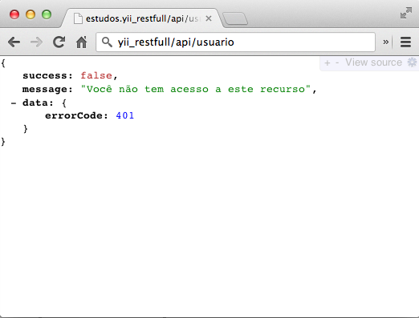
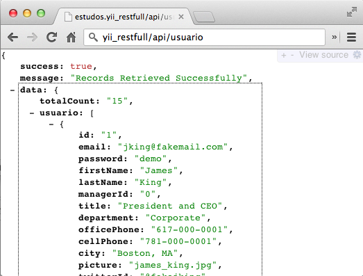

Yii Restfull Sample
====

### Exemplo de sistema restfull Yii com restrição de acesso via session. 

Projeto Exemplo utilizando a extensão [RESTFullYii](https://github.com/evan108108/RESTFullYii).

É um projeto padrão do Yii configurado com uma única tabela Mysql Usuários apenas para demostrar a funcionalidade.

Dentro da pasta `protected/data` contém o dump para criação da tabela.

Foi feito um ajuste/alteração na extensão no método `filterRestAccessRules` 
do `ERestController` para permitir controle de acesso via session.

#####protected/extensions/RESTFullYii/components/ERestController.php

```php
	public function filterRestAccessRules( $c )
	{
		Yii::app()->clientScript->reset(); //Remove any scripts registered by Controller Class
		Yii::app()->onException = array($this, 'onException'); //Register Custom Exception

		if(Yii::app()->session['isLogged']){ 
			$c->run(); 
		}else{
			throw new CHttpException(401, 'Você não tem acesso a este recurso');
		}

	}	
```

#####protected/config/main.php

```php
	...
	'components'=>array(
		'user'=>array(
			// enable cookie-based authentication
			'allowAutoLogin'=>true,
            'autoRenewCookie' => true,
		),

		'session' => array (
		    'autoStart' => true,
		    'class' => 'system.web.CDbHttpSession',
		    'connectionID' => 'db',
		    'sessionTableName' => 've_sessions',
		),

		'urlManager' => array(
			'urlFormat' => 'path',
			'showScriptName'=>true,
			'caseSensitive'=>false,
			'rules' => require(dirname(__FILE__).'/../extensions/restfullyii/config/routes.php'),
		),

		'db'=>array(
			'connectionString' => 'mysql:host=localhost;dbname=test',
			'username' => 'root',
			'password' => 'root',

			'emulatePrepare'=>true,
			'charset' => 'utf8',
			'initSQLs'=>array("set time_zone='-03:00';"),
			'nullConversion' => PDO::NULL_EMPTY_STRING,
		),

		'errorHandler'=>array(
			// use 'site/error' action to display errors
			'errorAction'=>'site/error',
		),
		'log'=>array(
			'class'=>'CLogRouter',
			'routes'=>array(
				array(
					'class'=>'CFileLogRoute',
					'levels'=>'error, warning',
				),
			),
		),
	),

	// application-level parameters that can be accessed
	// using Yii::app()->params['paramName']
	'params'=>array(
		// this is used in contact page
		'adminEmail'=>'webmaster@example.com',
	    'RESTusername' => 'admin@restuser',
	    'RESTpassword' => 'admin@Access',
	),        ...
```


#####Criado arquivo `.htaccess`

	RewriteEngine On
	RewriteBase /
	RewriteCond %{REQUEST_FILENAME} !-f
	RewriteCond %{REQUEST_FILENAME} !-d
	RewriteRule ^(.*)\?*$ index.php/$1 [L,QSA]
    
Com esta configuração acima posso acessar seu sistema omitindo o index.php. Também é preciso setar `'showScriptName'=>false,` no config/main.php.

```php
		'urlManager' => array(
			'showScriptName'=>false,
			'caseSensitive'=>false,
			'rules' => require(dirname(__FILE__).'/../extensions/restfullyii/config/routes.php'),
		),


```

Exemplo de acesso com e sem esse ajuste.

	Mudaria
    
    De: `http://localhost/yii_restfull/index.php/api/usuario`

	Para: `http://yii_restfull/api/usuario`

Para fazer funcionar isso é necessário ajustar a configuração do `Apache`. Porém isso é assunto para outro post. Uso aqui uma mac então, no meu caso, precisei alterar dois arquivos. (`/etc/hosts` e `/etc/apache/extras/httpd-vhosts.conf`.


######hosts

	127.0.0.1   yii_restfull

######vhosts.conf

```
<VirtualHost *:80>
	DocumentRoot "/www/yii_restfull_sample"
	ServerName yii_restfull
</VirtualHost>
```


####Finalizando

Com isso acredito que já seja possível acessar os serviços no caminho.
Não esqueça de criar a tabela no seu mysql e ajustar o acesso.

Para acessar a api faça o logon com user/senha: 

- demo/demo ou admin/admin
 
 
 Exemplo de acesso a api deste projeto:
 
`http://yii_restfull/api/usuario`
 
 ou

`http://yii_restfull/index.php/api/usuario`


#####Visão do acesso sem ter feito o login.



#####Visão do acesso já logado no sistema



    

